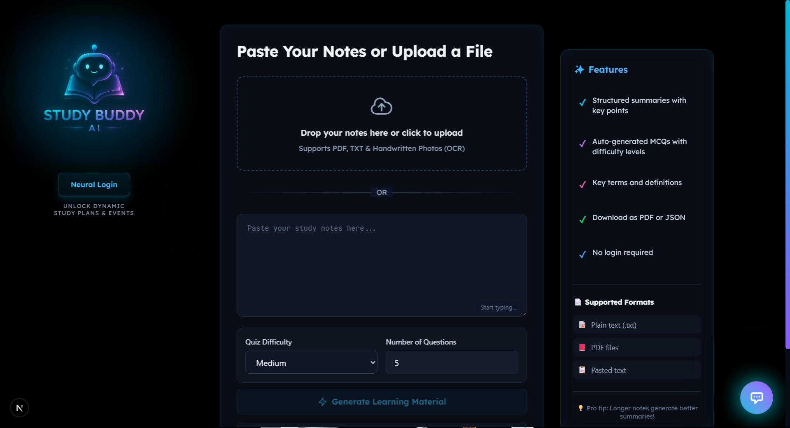
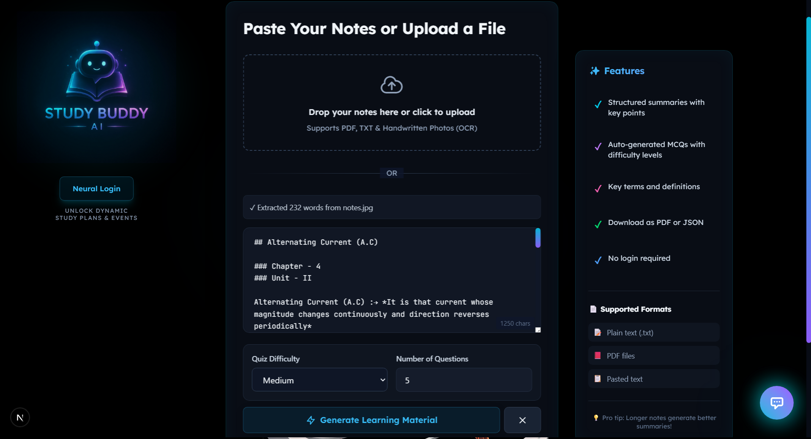
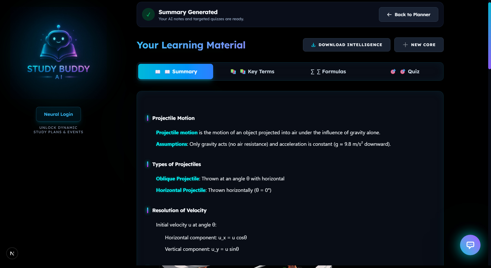
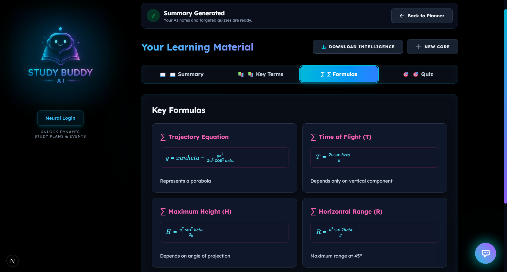

# Hackathon Project - HackathonSage 🚀

### 👥 Team Details
- **Team Name:** Quantamaniacs
- **Team ID:** UDB:J9WR
- **Problem Statement (PS) ID:** 01

---

# StudyBuddy AI 🎓

> **Hyper-Personalized AI Student Operating System.** AI-powered notes, persistent chat history, hyper-personalized roadmaps, and career mentorship — built to empower students.

## 📋 Table of Contents

- [Overview](#overview)
- [Features](#features)
- [Tech Stack](#tech-stack)
- [Screenshots](#screenshots)
- [Getting Started](#getting-started)
  - [Prerequisites](#prerequisites)
  - [Installation](#installation)
  - [Environment Setup](#environment-setup)
  - [Running Locally](#running-locally)
- [API Configuration](#api-configuration)
- [Deployment](#deployment)
- [Project Structure](#project-structure)
- [Features Deep Dive](#features-deep-dive)

## 🌟 Overview

**StudyBuddy AI** is an innovative AI-powered study companion designed to help students study smarter, not harder. Built with Next.js and powered by cutting-edge AI models (Groq), it transforms raw study material into comprehensive learning resources in seconds.

Perfect for:
- 🎯 JEE/NEET aspirants
- 📚 College students preparing for exams
- 🏫 School students managing board exams
- 👥 Anyone who wants to study more efficiently

## ✨ Key Features

### 1. **Hyper-Personalized Onboarding**
A multi-step, engaging wizard that builds a deep neural profile of the student — covering academic stream, branch, year, career goals, skill levels, and even internet accessibility.

### 2. **ChatGPT-like Persistent Sessions**
Full conversation history persistence. Create multiple "Neural Sessions," continue previous chats after re-login, and maintain a library of your past study interactions.

### 3. **AI Notes Summarizer**
Transform lengthy study material into clean, structured summaries with key points extracted automatically.
- Bullet-point format for easy scanning
- Bold key terms and concepts
- Expert tips and common mistakes highlighted

### 4. **Adaptive MCQ Generator**
Auto-generate practice quizzes from your notes with adjustable difficulty levels.
- **Easy**, **Medium**, **Hard** difficulty options
- Detailed explanations for each answer
- Automatically detects and tracks **Weak Topics** based on performance

### 5. **Career Roadmap & Skill Tracker**
Get an AI-generated roadmap tailored to your target package and role (e.g., SDE at Google, PSU Job). Track pending vs. completed skills with real-time progress bars.

### 6. **Student Dashboard (Operating System)**
A mission-control style interface featuring:
- **Study Streak System**: Visualizer for mastery and consistency.
- **Recent Activity Logs**: See exactly what you've done across the platform.
- **Recommended Next Step**: AI-generated suggestions for what to study next.
- **Weak Nodes Tracker**: Direct access to topics you need to revise.

### 7. **Neural Study Chatbot**
Ask anything about your study material and get instant, student-friendly explanations with full history persistence.

### 8. **Agentic Voice Caller**
Receive AI voice calls if you miss a deadline or need a study nudge, powered by Twilio.
phone number for notifications

## 🛠️ Tech Stack

| Category | Technology |
|----------|------------|
| **Frontend** | React 19.2, Next.js 16.2 (App Router), Tailwind CSS 4 |
| **Backend** | Node.js, Next.js API (Serverless), Mongoose |
| **Database** | **MongoDB Atlas** (Persistent Persistence) |
| **Auth** | **JWT (JSON Web Tokens)** & **Bcrypt.js** |
| **AI/LLM** | Groq SDK (LLaMA/Mixtral models) |
| **Voice** | Twilio SDK |
| **PDF Processing** | pdf-parse, pdfjs-dist, jsPDF, html2canvas |
| **UI Components** | Headless UI, Heroicons, Framer Motion |
| **Type Safety** | TypeScript |

## 📸 Screenshots

### Dashboard & Notes Summarizer


### Quiz Generation & Task Management


### Study Planner Interface


### AI Chatbot & Interactive Calendar


---

## 🚀 Getting Started

### Prerequisites

Before setting up, ensure you have:

- **Node.js**: v18+ ([Download](https://nodejs.org/))
- **npm** or **yarn**: Latest version
- **Git**: For version control
- **API Keys**:
  - Groq API Key (free tier available at [groq.com](https://groq.com))
  - Twilio Account (optional, for voice notifications)
  
### Installation

1. **Clone the repository**
   ```bash
   git clone https://github.com/your-username/study-buddy-ai.git
   cd study-buddy-ai
   ```

2. **Install dependencies**
   ```bash
   npm install
   # or
   yarn install
   ```

3. **Verify installation**
   ```bash
   npm list | head -20
   ```

### Environment Setup

1. **Create `.env.local` file in the project root**
   ```bash
   touch .env.local
   ```

2. **Add the following environment variables**
   
   Create a `.env.local` file:
   ```env
   # Groq API - Required
   # Get your free API key from: https://console.groq.com/keys
   GROQ_API_KEY=gsk_your_api_key_here

   # Base URLs - Required
   # Use your local development URL or deployed URL
   NEXT_PUBLIC_API_URL=http://localhost:3000
   NEXT_PUBLIC_BASE_URL=http://localhost:3000

   # Twilio Configuration - Optional (for voice notifications)
   # Get credentials from: https://www.twilio.com/console
   TWILIO_ACCOUNT_SID=ACxxxxxxxxxxxxxxxxxxxx
   TWILIO_AUTH_TOKEN=your_auth_token_here
   TWILIO_PHONE_NUMBER=+1234567890
   ```

3. **Getting API Keys**

   **Groq API:**
   - Visit [console.groq.com/keys](https://console.groq.com/keys)
   - Sign up (free account available)
   - Create a new API key
   - Copy and paste into `.env.local`

   **Twilio (Optional):**
   - Create account at [twilio.com](https://www.twilio.com)
   - Navigate to Console → Account SID and Auth Token
   - Verify a phone number for receiving calls
   - Add credentials to `.env.local`

### Running Locally

1. **Start the development server**
   ```bash
   npm run dev
   ```
   
   Output should show:
   ```
   ▲ Next.js 16.2.1
   - Local:        http://localhost:3000
   ```

2. **Open in browser**
   - Navigate to [http://localhost:3000](http://localhost:3000)
   - You should see the StudyBuddy landing page

3. **Login/Demo**
   - Click "Generate Notes Free" or "Enter AI Dashboard"
   - Start by pasting study material
   - Explore all features

4. **Stop the server**
   ```bash
   Ctrl + C
   ```

## 🔧 API Configuration

### Available API Routes

| Route | Method | Purpose |
|-------|--------|---------|
| `/api/auth/register` | POST | Student account registration |
| `/api/auth/login` | POST | Secure JWT login |
| `/api/dashboard` | GET | Aggregated OS stats & activities |
| `/api/chats` | GET/POST | Fetch history & save sessions |
| `/api/tasks` | GET/POST | CRUD for persistent study plans |
| `/api/summarize` | POST | Generate study summaries |
| `/api/generate_mcq` | POST | Create practice quizzes |
| `/api/ocr` | POST | Extract text from PDFs |
| `/api/twilio/call` | POST | Initiate AI voice nudge |

### Example API Requests

**Summarize Notes:**
```bash
curl -X POST http://localhost:3000/api/summarize \
  -H "Content-Type: application/json" \
  -d '{
    "text": "Your study material here..."
  }'
```

**Generate Quiz:**
```bash
curl -X POST http://localhost:3000/api/generate_mcq \
  -H "Content-Type: application/json" \
  -d '{
    "text": "Your study material here...",
    "difficulty": "Medium",
    "count": 5
  }'
```

## 📦 Project Structure

```
study-buddy-ai/
│   ├── pdfExtractor.ts           # PDF text extraction
│   ├── pdfExport.ts              # PDF export functionality
│   ├── textProcessing.ts         # Text cleaning & validation
│   ├── scheduler.ts              # Study schedule generation
│   ├── sounds.ts                 # Audio notifications
│   ├── animations.ts             # UI animations
│   └── UserContext.tsx           # Global user state
├── public/                       # Static assets
│   ├── logo.png                  # App logo
│   └── screenshots/              # Feature screenshots
├── .env.local                    # Environment variables (create this)
├── package.json                  # Dependencies & scripts
├── next.config.ts                # Next.js configuration
├── tsconfig.json                 # TypeScript configuration
└── tailwind.config.mjs           # Tailwind CSS configuration
```

## 💡 Features Deep Dive

### Study Material Input
- **Paste text directly** - Copy-paste from documents
- **Upload PDFs** - Automatic OCR extraction
- **Upload images** - Screenshot OCR with text extraction
- **Supports multiple formats** - Rich text, plain text, markdown

### Summary Generation
- Structured bullet-point format
- Key concepts bolded
- Expert tips highlighted
- Mathematical formulas extracted
- Common mistakes identified

### Quiz Generation
- **Adaptive difficulty**: Easy → Medium → Hard progression
- **Question types**: Multiple choice, true/false, fill-in-blank
- **Detailed explanations**: Why each answer is correct/incorrect
- **Performance tracking**: See your progress over time

### Study Plan Generation
Uses AI to create a realistic study schedule considering:
- Days remaining until exam
- Syllabus breadth
- Student's current level
- Exam pattern analysis
- Topic weightage

### Chatbot Capabilities
- Concept explanation
- Example generation
- Memory techniques
- Problem-solving guidance
- Quick clarifications

---

## 🌐 Deployment

### Deploying to Vercel (Recommended)

1. **Push to GitHub**
   ```bash
   git add .
   git commit -m "Initial commit"
   git push origin main
   ```

2. **Connect to Vercel**
   - Go to [vercel.com](https://vercel.com)
   - Sign in with GitHub
   - Click "New Project"
   - Select your repository
   - Click "Import"

3. **Configure Environment Variables**
   - In Vercel dashboard: Settings → Environment Variables
   - Add all variables from `.env.local`:
     - `GROQ_API_KEY`
     - `NEXT_PUBLIC_API_URL`
     - `NEXT_PUBLIC_BASE_URL`
     - `TWILIO_ACCOUNT_SID`
     - `TWILIO_AUTH_TOKEN`
     - `TWILIO_PHONE_NUMBER`

4. **Deploy**
   - Click "Deploy"
   - Wait for build completion
   - Your app is live! 🎉

### Alternative: Docker Deployment

1. **Create `Dockerfile`**
   ```dockerfile
   FROM node:18-alpine
   WORKDIR /app
   COPY package*.json ./
   RUN npm ci
   COPY . .
   ENV NEXT_TELEMETRY_DISABLED=1
   RUN npm run build
   EXPOSE 3000
   CMD ["npm", "start"]
   ```

2. **Build and run**
   ```bash
   docker build -t study-buddy-ai .
   docker run -p 3000:3000 -e GROQ_API_KEY=your_key study-buddy-ai
   ```

---

## 🐛 Troubleshooting

### Common Issues

**Issue: "GROQ_API_KEY is not set"**
- Solution: Check `.env.local` file exists in project root
- Ensure `GROQ_API_KEY` variable is properly set
- Restart dev server after changing env variables

**Issue: "Cannot fetch from API"**
- Solution: Verify `NEXT_PUBLIC_API_URL` matches your deployment URL
- Check API routes are in `/app/api/` directory
- Restart development server

**Issue: "PDF upload not working"**
- Solution: Verify `pdf-parse` and `pdfjs-dist` are installed
- Check file size (limit: 10MB recommended)
- Try with a different PDF format

**Issue: "Twilio calls not working"**
- Solution: Verify Twilio credentials in `.env.local`
- Ensure phone number is verified in Twilio console
- Check account balance

### Need More Help?

- Check logs: `npm run dev` shows server errors
- Browser console: [F12] → Console tab for client errors
- Issues? Create a GitHub issue with error details

---

## 📝 Available Scripts

```bash
# Development
npm run dev          # Start dev server (http://localhost:3000)

# Production
npm run build        # Build for production
npm start            # Start production server

# Code Quality
npm run lint         # Run ESLint checks
npm run lint -- --fix  # Auto-fix ESLint issues
```

---

## 📄 License

This project is built during the **Hack-A-Sprint-Aurbindo Hackathon**. 

---

## 👥 Contributing

We welcome contributions! To contribute:

1. Fork the repository
2. Create a feature branch (`git checkout -b feature/amazing-feature`)
3. Commit your changes (`git commit -m 'Add amazing feature'`)
4. Push to the branch (`git push origin feature/amazing-feature`)
5. Open a Pull Request

---

## 🙏 Acknowledgments

- **Groq** - For the powerful LLaMA/Mixtral API
- **Vercel** - For seamless Next.js deployment
- **Twilio** - For voice call capabilities
- **Next.js Team** - For the amazing framework
- **All contributors** - Making studying smarter for everyone

---

## 🎯 Roadmap

- [ ] Mobile app (React Native)
- [ ] Offline mode support
- [ ] Community study groups
- [ ] Teacher dashboard
- [ ] Advanced analytics
- [ ] Multi-language support
- [ ] Video explanations with AI
- [ ] Integration with learning platforms

---

## 📞 Support

For issues, feature requests, or questions:
- Create a GitHub Issue
- Email: support@studybuddy-ai.com
- Discord: [Join our community](#)

---

**StudyBuddy AI** — *Study Smarter. Score Higher.* 🚀

Built with ❤️ for students worldwide.
